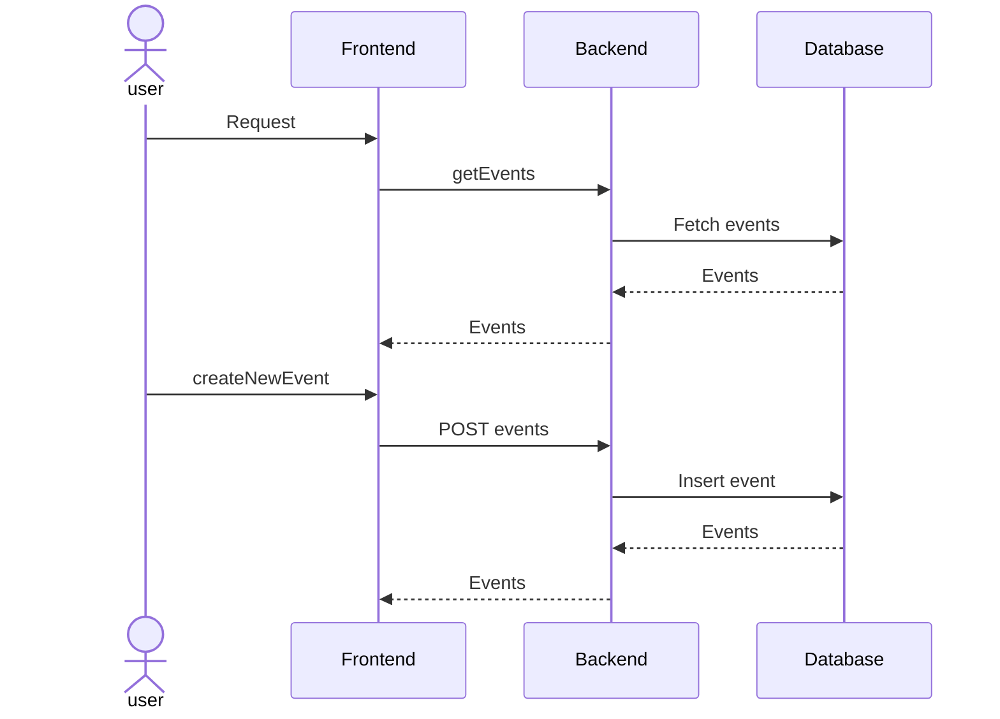
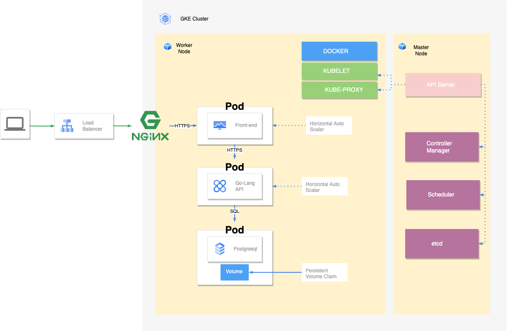

# Architecture

## Sequence Diagram
The following sequence diagram shows the interaction between the user, the frontend, the backend and the database.  
First the user requests the events from the frontend, which in turn requests the events from the backend.  
The backend fetches the events from the database and returns them to the frontend, which then returns them to the user.
The user can also create a new event, which is then sent to the frontend, which sends it to the backend,
which inserts it into the database and returns the updated list of events to the frontend,
which then returns it to the user.

The frontend is a static webpage, which calls a backend API written in golang, with gin as the http framework.
The backend uses gorm to to store and retrieve events from a postgres database.

## Kubernetes component diagram
